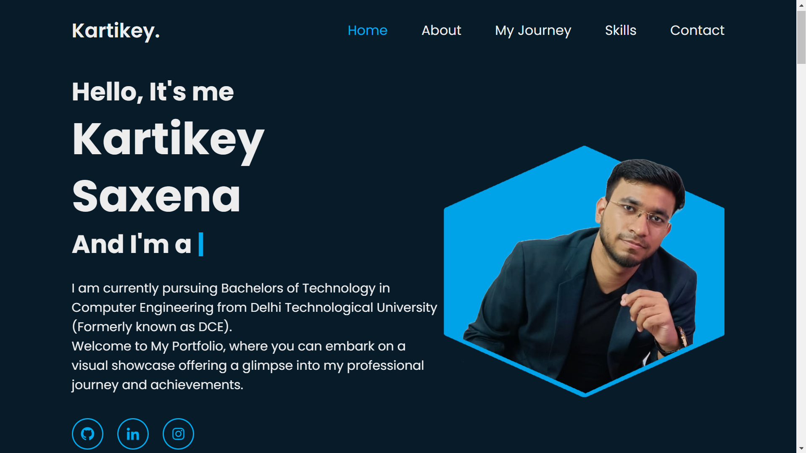
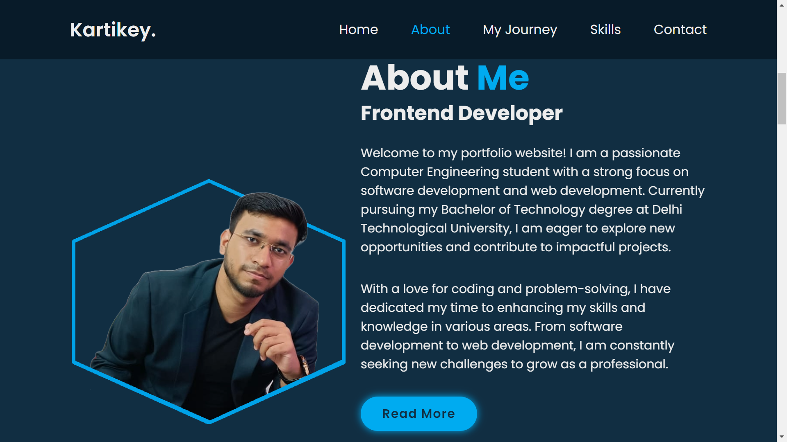
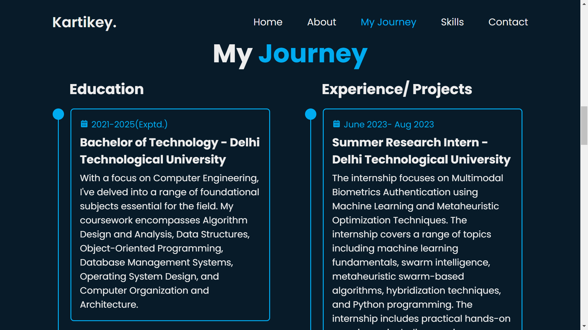
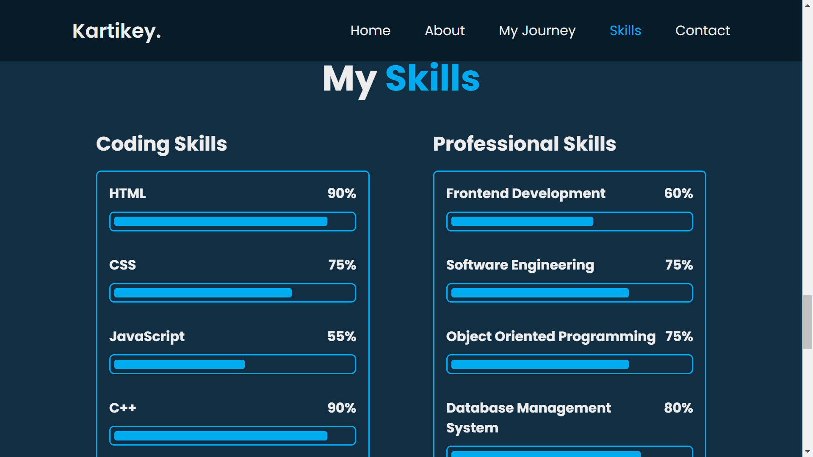
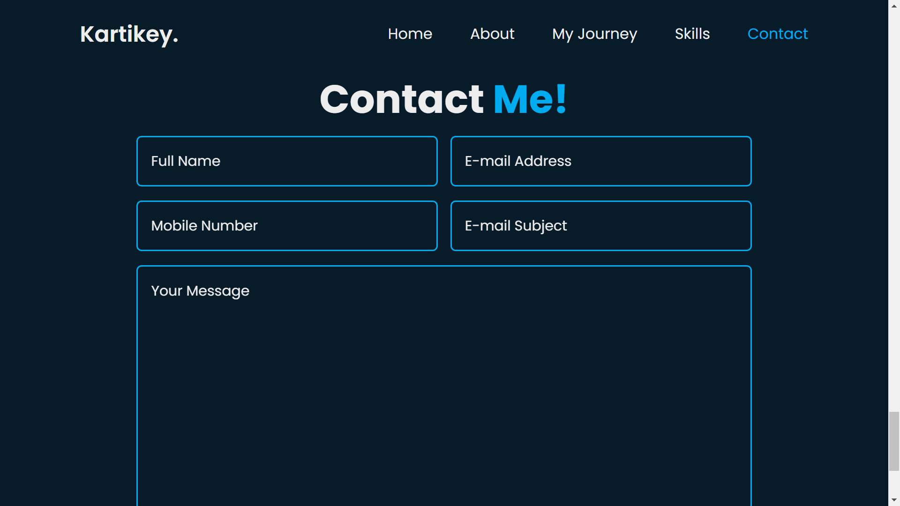

# Kartikey Saxena - Personal Portfolio



## Overview

This is a responsive personal portfolio website designed by Kartikey Saxena. It showcases my journey, skills, projects, and contact information.

## Table of Contents

- [Features](#features)
- [Screenshots](#screenshots)
- [Installation](#installation)
- [Usage](#usage)
- [Technologies Used](#technologies-used)
- [Contributing](#contributing)
- [License](#license)

## Features

- **Responsive Design:** Ensures optimal viewing experience across various devices.
- **Navigation:** Easy navigation through sections like Home, About, My Journey, Skills, and Contact.
- **Social Media Links:** Direct links to GitHub, LinkedIn, and Instagram profiles.
- **Interactive Elements:** Smooth scroll, hover effects, and animations enhance user experience.
- **Contact Form:** Allows visitors to send messages directly from the website.

## Screenshots









## Installation

1. Clone the repository:
   ```
   git clone https://github.com/PixelPirate-Kartikey/your-portfolio.git
   ```
2. Open `index.html` in your web browser.

## Usage

- Customize the content in `index.html` and `style.css` to match your personal information and preferences.
- Update social media links in the HTML.
- Modify the contact form action (`action="contact.php"`) to your server-side script for form submission.

## Technologies Used

- HTML5
- CSS3
- JavaScript
- [Boxicons](https://boxicons.com/)
- [ScrollReveal](https://unpkg.com/scrollreveal)
- [Typed.js](https://cdn.jsdelivr.net/npm/typed.js)

## Contributing

1. Fork the repository.
2. Create a new branch (`git checkout -b feature/new-feature`).
3. Make modifications and commit changes (`git commit -am 'Add new feature'`).
4. Push to the branch (`git push origin feature/new-feature`).
5. Create a pull request.

## License

This project is licensed under the MIT License - see the [LICENSE](LICENSE) file for details.

---

Feel free to adjust the sections, URLs, and instructions as per your actual setup and preferences. This README will help others understand your portfolio website and encourage contributions or collaborations effectively.
